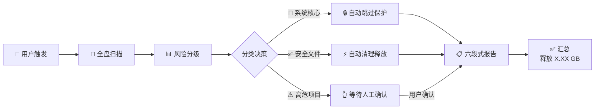
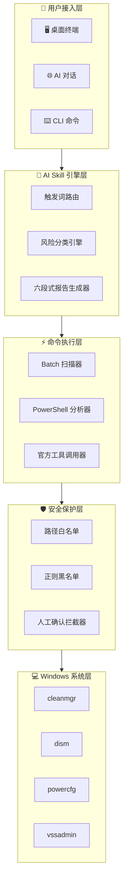

<p align="right">
  <strong>🇨🇳 简体中文</strong> &nbsp;|&nbsp; <a href="./README_EN.md">🇺🇸 English</a>
</p>

<br>

<p align="center">
  <a href="https://github.com/Shirleypp012/windows-cdisk-clean-skill"></a>
  <a href="./LICENSE"></a>
  
  
  <a href="https://github.com/Shirleypp012/windows-cdisk-clean-skill/stargazers"></a>
</p>

<br>

<h1 align="center" style="font-weight: 700; letter-spacing: -1px;">
  C 盘智能安全清理大师
</h1>

<p align="center">
  <em style="font-size: 20px; font-weight: 300;">Windows C 盘清理，从未如此安全、智能、优雅。</em>
</p>

<p align="center" style="color: #6B7280; max-width: 640px; margin: 0 auto; line-height: 1.8;">
  基于 AI Skill 架构的 Windows 系统盘清理方案<br>
  <strong>先扫描</strong> · <strong>后分级</strong> · <strong>再清理</strong> · <strong>零误删</strong>
</p>

<br>

<p align="center">
  <a href="#-快速开始">
    
  </a>
  &nbsp;&nbsp;
  <a href="#-使用方式">
    
  </a>
  &nbsp;&nbsp;
  <a href="https://github.com/Shirleypp012/windows-cdisk-clean-skill">
    
  </a>
</p>

<br>

<p align="center">
  
</p>

<br>
<br>

---

<br>

## 目录

<p align="center" style="line-height: 2.4;">

[✨ 为什么选择我们](#-为什么选择我们) · [🎯 核心功能](#-核心功能) · [⚙️ 工作流程](#️-工作流程) · [🖥️ 使用方式](#️-使用方式) · [🧱 项目架构](#-项目架构) · [📁 项目结构](#-项目结构) · [🚀 快速开始](#-快速开始) · [🗺️ 路线图](#️-路线图) · [📖 常见问题](#-常见问题) · [🤝 参与贡献](#-参与贡献) · [📄 许可证](#-许可证)

</p>

<br>
<br>

---

<br>

## ✨ 为什么选择我们

<p align="center" style="max-width: 720px; margin: 0 auto; color: #6B7280; line-height: 1.8;">
  传统 C 盘清理工具要么<strong>太激进</strong>容易删崩系统，要么<strong>太保守</strong>清理不干净。
  <br>
  我们另辟蹊径 —— 用 AI 做判断，用官方工具做执行。
</p>

<br>

<p align="center">

| | | |
|:-:|:-:|:-:|
| <br>🛡️<br><br>**零误删保障**<br><br><sub>三级风险分类<br>系统核心文件永久保护</sub><br><br> | <br>🧠<br><br>**AI 驱动决策**<br><br><sub>智能识别安全/风险文件<br>自动分级，无需专业知识</sub><br><br> | <br>⚡<br><br>**纯官方工具**<br><br><sub>不依赖任何第三方软件<br>所有操作透明可审计</sub><br><br> |

</p>

<br>
<br>

---

<br>

## 🎯 核心功能

<br>

<table align="center">
  <tr>
    <td width="50%" valign="top">
      <br>

### 🔍 全盘智能扫描

      一键扫描 C 盘所有目录。
      自动识别占用空间的文件类型。
      精准锁定垃圾源头。

      <br>
    </td>
    <td width="50%" valign="top">
      <br>

### 📊 三级风险分类

      🛑 **系统核心** → 永久保护<br>
      ✅ **安全垃圾** → 自动清理<br>
      ⚠️ **高危项目** → 人工确认

      <br>
    </td>
  </tr>
  <tr>
    <td width="50%" valign="top">
      <br>

### 🤖 AI Skill 一键部署

      导入即用，无需安装。
      支持 Claude、Cursor、Codex。
      只需一句「清理 C 盘」即可触发。

      <br>
    </td>
    <td width="50%" valign="top">
      <br>

### 📋 六段式专业报告

      红线警示 · 安全清单 · 高危清单
      官方教程 · 大文件定位 · 汇总报告

      <br>
    </td>
  </tr>
  <tr>
    <td width="50%" valign="top">
      <br>

### 🖥️ 三端全覆盖

      **桌面端** → 管理员终端一键执行<br>
      **网页端** → AI 对话中直接使用<br>
      **CLI 端**  → `/cdisk-clean` 触发

      <br>
    </td>
    <td width="50%" valign="top">
      <br>

### 🌍 小白友好

      不需要懂命令行。
      不需要懂系统原理。
      说一句「清理 C 盘」即可。

      <br>
    </td>
  </tr>
  <tr>
    <td width="50%" valign="top">
      <br>

### 🛡️ 系统文件黑名单

      正则匹配 + 路径白名单。
      System32、注册表、驱动目录
      <strong>绝对不可触碰</strong>。

      <br>
    </td>
    <td width="50%" valign="top">
      <br>

### 🔓 MIT 全面开源

      完全透明，自由商用。
      每个人都可以审计、修改、再分发。

      <br>
    </td>
  </tr>
</table>

<br>
<br>

---

<br>

## ⚙️ 工作流程

<br>



<br>
<br>

---

<br>

## 🖥️ 使用方式

<br>

### 🖥 桌面端 · Windows 终端

```bash
# 第一步：右键 → 「以管理员身份运行」终端
# 第二步：在 AI 客户端中导入 SKILL.md
# 第三步：在 AI 对话中输入
清理C盘
```

> AI 自动执行全盘扫描 → 分级 → 安全清理 → 输出报告。全程无需手打一行命令。

<br>

### 🌐 网页端 · AI 对话

在任何支持 Skill 的 AI 客户端（Claude / Cursor / Codex）中：

> 👤 **用户**：清理 C 盘  
> 🤖 **AI**：正在扫描 C 盘空间... [自动分析 → 自动清理 → 输出报告]

无需命令行。对话即清理。

<br>

### ⌨️ CLI 端 · 命令触发

```bash
# Claude Code CLI
/cdisk-clean

# 自然语言触发（支持任意 Skill 兼容 CLI）
C盘清理 / 清理C盘 / C盘满了 / C盘瘦身 / 释放C盘空间 / 磁盘清理
```

<br>

> **📌 当前平台：Windows 10 / 11**&nbsp;&nbsp;&nbsp;‖&nbsp;&nbsp;&nbsp; **🗓 后续计划：macOS · iOS**

<br>
<br>

---

<br>

## 🧱 项目架构

<br>



<br>
<br>

---

<br>

## 📁 项目结构

<br>

```
windows-cdisk-clean-skill/
├── SKILL.md                    # Skill 入口 — CLI 端直接加载
├── README.md                   # 中文主文档（当前文件）
├── README_EN.md                # English README
├── Windows-C盘智能安全清理大师.skill  # 通用 Skill 格式 — GUI 客户端导入
├── LICENSE                     # MIT 许可证
│
├── scripts/                    # 独立可执行脚本
│   ├── scan.bat               #   全盘扫描脚本
│   ├── auto-clean.bat         #   安全自动清理脚本
│   └── advanced-clean.bat     #   高危项目清理脚本（需确认）
│
├── docs/                       # 扩展文档
│   ├── guide.md               #   完整使用指南
│   ├── faq.md                 #   常见问题详解
│   ├── risk-levels.md         #   三级分类规则参考
│   └── screenshots/           #   📸 产品截图（预留）
│
└── .github/                    # GitHub 社区配置
    ├── ISSUE_TEMPLATE/         #   Issue 模板
    └── PULL_REQUEST_TEMPLATE.md # PR 模板
```

<br>
<br>

---

<br>

## 🚀 快速开始

<br>

### 环境要求

| 项目 | 要求 |
|------|------|
| 🖥 操作系统 | **Windows 10 / 11**（当前仅支持 Windows，macOS/iOS 规划中） |
| 🔑 权限 | 管理员权限（安全清理操作需要） |
| 🤖 AI 客户端 | Claude / Cursor / OpenAI Codex / 任意支持 Skill 的客户端 |
| 📦 额外依赖 | **无** — 仅使用 Windows 官方自带工具 |

<br>

### 三步开始

<br>

**① 克隆仓库**

```bash
git clone https://github.com/Shirleypp012/windows-cdisk-clean-skill.git
```

<br>

**② 导入 AI 客户端**

| 客户端 | 导入方式 |
|--------|----------|
| **Claude Code** | 将 `windows-cdisk-clean-skill/` 放入 `.claude/skills/` 目录 |
| **Cursor** | Settings → Skills → Import → 选择 `SKILL.md` |
| **OpenAI Codex** | 将 `SKILL.md` 内容粘贴到自定义指令中 |
| **通用客户端** | 导入 `Windows-C盘智能安全清理大师.skill` 文件 |

<br>

**③ 开始清理**

```
在 AI 对话中直接输入：清理C盘
```

> AI 将自动执行完整工作流。**全程无需记忆任何命令。**

<br>
<br>

---

<br>

## 🗺️ 路线图

<br>

- [x] 三级风险分类体系
- [x] 六段式专业报告
- [x] Claude / Cursor / OpenAI Codex 多端兼容
- [x] 安全文件自动清理
- [x] 系统核心文件黑名单保护
- [x] 桌面端 · 网页端 · CLI 端全覆盖
- [x] MIT 开源
- [ ] macOS 支持
- [ ] iOS 快捷指令集成
- [ ] 清理历史记录与一键回滚
- [ ] 定时自动清理（Cron）
- [ ] 多语言国际化（日文、韩文）
- [ ] 可视化磁盘占用热力图
- [ ] VS Code 插件
- [ ] 企业批量部署方案

<br>
<br>

---

<br>

## 📖 常见问题

<br>

<details>
<summary><strong>这个工具安全吗？会不会删错文件？</strong></summary>
<br>

**绝对安全。** 三重保护机制：① 三级风险分类 ② 正则黑名单白名单 ③ 高危项目人工确认。System32、注册表、系统驱动目录在任何情况下都不会被触碰。

<br>
</details>

<details>
<summary><strong>我需要安装什么软件吗？</strong></summary>
<br>

**完全不需要。** 本 Skill 只调用 Windows 自带工具（`cleanmgr`、`dism`、`powercfg` 等），零第三方依赖。你只需要一个支持 Skill 的 AI 客户端。

<br>
</details>

<details>
<summary><strong>支持哪些 AI 客户端？</strong></summary>
<br>

Claude、Cursor、OpenAI Codex，以及所有遵循 Skill 标准的 AI 客户端。桌面端、网页端、CLI 端均可使用。

<br>
</details>

<details>
<summary><strong>我是电脑小白，能用吗？</strong></summary>
<br>

**这就是为你设计的。** 只需要在 AI 对话中说一句「清理 C 盘」，剩下的全自动完成。每一步都有清晰的中文说明，高危操作会明确告知后果并等待你确认。

<br>
</details>

<details>
<summary><strong>为什么不支持 macOS？</strong></summary>
<br>

V1.0 聚焦 Windows 平台——这是目前使用最广泛、C 盘问题最普遍的桌面系统。macOS 的磁盘管理机制完全不同，我们正在规划 V1.1 版本加入支持。欢迎 <a href="https://github.com/Shirleypp012/windows-cdisk-clean-skill">Watch 仓库</a> 获取更新通知。

<br>
</details>

<details>
<summary><strong>被清理的文件能恢复吗？</strong></summary>
<br>

- 普通临时文件 → 可通过回收站恢复
- `cleanmgr` + `dism` 深度清理 → **不可逆**，执行前有明确提示
- 高危项目（Windows.old、系统还原点）→ **默认不清理**，需你主动确认

<br>
</details>

<details>
<summary><strong>可以商用吗？</strong></summary>
<br>

**完全可以。** MIT 许可证，可免费商用、修改、再分发。无需署名，无任何限制。

<br>
</details>

<details>
<summary><strong>如何确认清理效果？</strong></summary>
<br>

每次清理结束后会输出**六段式汇总报告**：清理前后空间对比、每项释放的具体字节数、待处理项目清单。数字说话，一目了然。

<br>
</details>

<br>
<br>

---

<br>

## 🤝 参与贡献

<br>

我们欢迎所有形式的贡献——代码、文档、翻译、建议。

<br>

```bash
# 贡献流程
1.  Fork 本仓库
2.  创建分支  →  git checkout -b feat/amazing-idea
3.  提交更改  →  git commit -m 'feat: add amazing idea'
4.  推送分支  →  git push origin feat/amazing-idea
5.  提交 Pull Request 🎉
```

<br>

| 类型 | 说明 |
|------|------|
| 🐛 Bug 修复 | 发现清理逻辑或兼容性问题 |
| ✨ 新功能 | 新的清理项、风险分类规则 |
| 📝 文档 | 改进教程、翻译、FAQ |
| 🎨 客户端适配 | 适配新的 AI 客户端 |

<br>

> 提交前请阅读 [CONTRIBUTING.md](./CONTRIBUTING.md) 了解 Commit 规范。

<br>
<br>

---

<br>

## 📄 许可证

<br>

```
MIT License · Copyright (c) 2024 Shirley

✅ 可免费商用   ✅ 可修改   ✅ 可再分发   ✅ 无需署名
```

<br>

[](./LICENSE)

<br>
<br>

---

<br>

<p align="center">
  <sub>Made with 🩵 by <a href="https://github.com/Shirleypp012">Shirley</a></sub>
</p>

<p align="center" style="line-height: 2.4;">
  <a href="https://github.com/Shirleypp012">🐙 GitHub</a>
  &nbsp;·&nbsp;
  <a href="mailto:1191728729@qq.com">📧 1191728729@qq.com</a>
  &nbsp;·&nbsp;
  <a href="https://github.com/Shirleypp012/windows-cdisk-clean-skill">⭐ 给项目点个 Star</a>
</p>

<br>
<p align="center">
  <sub>© 2024 Shirley · windows-cdisk-clean-skill · MIT License</sub>
</p>
