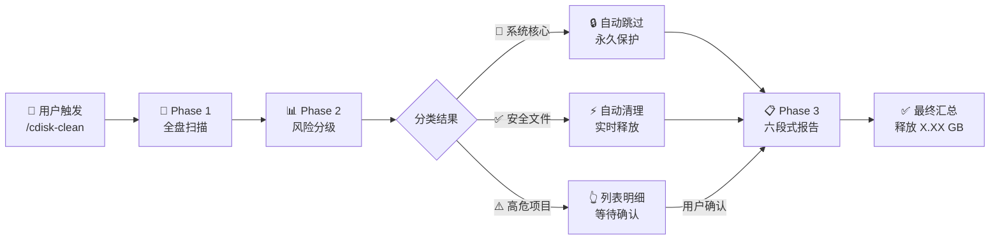
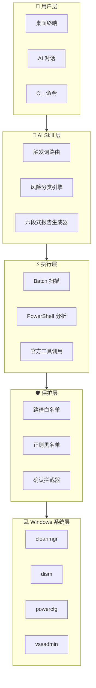

<p align="center">
  
  
  
  
  
</p>

<br>

<p align="center">
  <picture>
    <source media="(prefers-color-scheme: dark)" srcset="https://img.shields.io/badge/Disk%20Clean-Pro-2563EB?style=for-the-badge&logo=data:image/svg+xml;base64,PHN2ZyB4bWxucz0iaHR0cDovL3d3dy53My5vcmcvMjAwMC9zdmciIHdpZHRoPSIyNCIgaGVpZ2h0PSIyNCIgdmlld0JveD0iMCAwIDI0IDI0IiBmaWxsPSJub25lIiBzdHJva2U9IiNmZmYiIHN0cm9rZS13aWR0aD0iMiI+PHBhdGggZD0iTTIxIDE2VjhhNSA1IDAgMCAwLTUtNUg4YTUgNSAwIDAgMC01IDV2OGE1IDUgMCAwIDAgNSA1aDh6Ii8+PHBhdGggZD0iTTEyIDEydjYiLz48cGF0aCBkPSJNOSAxNWg2Ii8+PC9zdmc+">
    
  </picture>
</p>

<br>

<h1 align="center">C 盘智能安全清理大师</h1>

<p align="center">
  <em>Windows C 盘清理，从未如此安全、智能、优雅。</em>
</p>

<p align="center" style="font-size: 18px; color: #6B7280; max-width: 680px; margin: 0 auto;">
  基于 AI Skill 架构的 Windows 系统盘清理方案<br>
  先扫描 · 后分级 · 再清理 · 零误删
</p>

<br>

<p align="center">
  <a href="#-快速开始">
    
  </a>
  &nbsp;&nbsp;
  <a href="#-项目结构">
    
  </a>
</p>

<br>

<p align="center">
  <picture>
    <source media="(prefers-color-scheme: dark)" srcset="https://placehold.co/960x540/0F172A/94A3B8?text=Product+Screenshot+Coming+Soon&font=Inter">
    
  </picture>
</p>

<br>
<br>

---

<br>

## 目录

<p align="center">

[✨ 为什么选择我们](#-为什么选择我们)
·
[🎯 核心功能](#-核心功能)
·
[⚙️ 工作流程](#️-工作流程)
·
[🖥️ 使用方式](#️-使用方式)
·
[🧱 项目架构](#-项目架构)
·
[📁 项目结构](#-项目结构)
·
[🚀 快速开始](#-快速开始)
·
[🗺️ 路线图](#️-路线图)
·
[📖 常见问题](#-常见问题)
·
[🤝 参与贡献](#-参与贡献)
·
[📄 许可证](#-许可证)

</p>

<br>
<br>

---

<br>

## ✨ 为什么选择我们

<p align="center" style="max-width: 720px; margin: 0 auto; color: #6B7280;">
  传统 C 盘清理工具要么太激进容易删崩系统，要么太保守清理不干净。我们另辟蹊径。
</p>

<br>

<table align="center">
  <tr>
    <td align="center" width="33%">
      <br>
      <br><br>
      <strong>零误删保障</strong><br>
      <sub>三级风险分类<br>系统核心文件永久保护</sub>
      <br><br>
    </td>
    <td align="center" width="33%">
      <br>
      <br><br>
      <strong>AI 驱动决策</strong><br>
      <sub>智能识别安全/风险文件<br>自动分级，无需专业知识</sub>
      <br><br>
    </td>
    <td align="center" width="33%">
      <br>
      <br><br>
      <strong>纯官方工具</strong><br>
      <sub>不依赖任何第三方软件<br>所有操作透明可审计</sub>
      <br><br>
    </td>
  </tr>
</table>

<br>
<br>

---

<br>

## 🎯 核心功能

<br>

<table align="center">
  <tr>
    <td width="50%">
      <br>

### 🔍 全盘智能扫描

      一键扫描 C 盘所有目录，自动识别占用空间的文件类型，精准锁定垃圾源头。

      <br>
    </td>
    <td width="50%">
      <br>

### 📊 三级风险分类

      🛑 系统核心 → 永久保护<br>
      ✅ 安全垃圾 → 自动清理<br>
      ⚠️ 高危项目 → 人工确认

      <br>
    </td>
  </tr>
  <tr>
    <td width="50%">
      <br>

### 🤖 AI Skill 一键部署

      导入即用，无需安装。支持 Claude、Cursor、OpenAI Codex 及所有兼容 AI 客户端。

      <br>
    </td>
    <td width="50%">
      <br>

### 📋 六段式专业报告

      红线警示 → 安全清单 → 高危清单 → 官方教程 → 大文件定位 → 汇总报告

      <br>
    </td>
  </tr>
  <tr>
    <td width="50%">
      <br>

### 🖥️ 三端全覆盖

      **桌面端**：管理员终端一键执行<br>
      **网页端**：AI 对话中直接使用<br>
      **CLI 端**：`/cdisk-clean` 命令触发

      <br>
    </td>
    <td width="50%">
      <br>

### 🌍 小白友好

      不需要懂命令行，不需要懂系统原理，打开 AI 客户端说一句"清理 C 盘"即可。

      <br>
    </td>
  </tr>
  <tr>
    <td width="50%">
      <br>

### 🛡️ 系统文件黑名单

      正则匹配 + 路径白名单双重保护，System32、注册表、驱动目录绝对不可触碰。

      <br>
    </td>
    <td width="50%">
      <br>

### 🔓 MIT 开源

      完全开源，免费商用。代码透明，每个人都可以审计、修改、再分发。

      <br>
    </td>
  </tr>
</table>

<br>
<br>

---

<br>

## ⚙️ 工作流程

<br>



<br>
<br>

---

<br>

## 🖥️ 使用方式

<br>

### 🖥 桌面端 · Windows 终端

```bash
# 第一步：右键 "以管理员身份运行" 终端
# 第二步：在 AI 客户端中导入 SKILL.md
# 第三步：输入触发词
C盘清理
```

AI 自动执行全盘扫描 → 分级 → 安全清理 → 输出报告。

<br>

### 🌐 网页端 · AI 对话

在任何支持 Skill 的 AI 客户端（Claude / Cursor / OpenAI Codex）中：

> 用户：清理 C 盘  
> AI：正在扫描 C 盘空间... [自动执行]

无需任何命令行操作，对话中完成全部流程。

<br>

### ⌨️ CLI 端 · 命令行触发

```bash
# Claude Code CLI
/cdisk-clean

# 或其他支持 Skill 的 CLI 工具
触发关键词：C盘清理 / 清理C盘 / C盘满了 / C盘瘦身 / 释放C盘空间 / 磁盘清理
```

<br>

> **当前平台**：Windows · **后续计划**：macOS / iOS

<br>
<br>

---

<br>

## 🧱 项目架构

<br>



<br>
<br>

---

<br>

## 📁 项目结构

<br>

```
cdisk-clean/
├── SKILL.md                    # Skill 入口（CLI 直接加载）
├── README.md                   # 中文主文档
├── README_EN.md                # English README
├── Windows-C盘智能安全清理大师.skill  # 通用 Skill 格式（可导入 GUI 客户端）
├── LICENSE                     # MIT 许可证
│
├── scripts/                    # 独立可执行脚本
│   ├── scan.bat               # 全盘扫描脚本
│   ├── auto-clean.bat         # 安全自动清理脚本
│   └── advanced-clean.bat     # 高危项目清理（需确认）
│
├── docs/                       # 文档
│   ├── guide.md               # 完整使用指南
│   ├── faq.md                 # 常见问题
│   ├── risk-levels.md         # 三级分类详解
│   └── screenshots/           # 截图（预留）
│
└── .github/                    # GitHub 配置
    ├── ISSUE_TEMPLATE/
    └── PULL_REQUEST_TEMPLATE.md
```

<br>
<br>

---

<br>

## 🚀 快速开始

<br>

### 环境要求

| 项目 | 要求 |
|------|------|
| 操作系统 | Windows 10 / 11（当前仅支持 Windows） |
| 权限 | 管理员权限（部分操作需要） |
| AI 客户端 | Claude / Cursor / OpenAI Codex / 任意支持 Skill 的客户端 |
| 额外依赖 | 无 |

<br>

### 三步开始

<br>

**① 下载 Skill 文件**

```bash
git clone https://github.com/your-username/cdisk-clean.git
```

<br>

**② 导入 AI 客户端**

| 客户端 | 导入方式 |
|--------|----------|
| **Claude Code** | 将 `cdisk-clean/` 放入 `.claude/skills/` 目录 |
| **Cursor** | Settings → Skills → Import → 选择 `SKILL.md` |
| **OpenAI Codex** | 将 `SKILL.md` 内容粘贴到自定义指令中 |
| **通用客户端** | 导入 `Windows-C盘智能安全清理大师.skill` |

<br>

**③ 触发清理**

```
在 AI 对话中输入：清理C盘
```

AI 将自动执行完整工作流。全程无需记忆任何命令。

<br>
<br>

---

<br>

## 🗺️ 路线图

<br>

- [x] 三级风险分类体系
- [x] 六段式专业报告
- [x] Claude / Cursor / OpenAI Codex 多端兼容
- [x] 安全文件自动清理
- [x] 系统核心文件黑名单保护
- [x] 桌面端 · 网页端 · CLI 端三端覆盖
- [x] MIT 开源
- [ ] macOS 支持
- [ ] iOS 快捷指令集成
- [ ] 清理历史记录与回滚
- [ ] 定时自动清理（Cron）
- [ ] 多语言国际化（日文、韩文）
- [ ] 可视化磁盘占用热力图
- [ ] VS Code 插件版
- [ ] 企业批量部署方案

<br>
<br>

---

<br>

## 📖 常见问题

<br>

<details>
<summary><strong>这个工具安全吗？会不会删错文件？</strong></summary>
<br>

**绝对安全。** 我们采用三级风险分类 + 正则黑名单的双重保护机制。System32、系统驱动、注册表等核心路径在任何情况下都不会被触碰。安全文件自动清理，高危项目必须你手动确认后才执行。

<br>
</details>

<details>
<summary><strong>我需要安装什么软件吗？</strong></summary>
<br>

**完全不需要。** 本 Skill 仅调用 Windows 自带工具（cleanmgr、dism、powercfg 等），不依赖任何第三方软件。你只需要一个支持 Skill 的 AI 客户端。

<br>
</details>

<details>
<summary><strong>支持哪些 AI 客户端？</strong></summary>
<br>

目前支持：Claude、Cursor、OpenAI Codex，以及所有遵循 Skill 标准的 AI 客户端。桌面端、网页端、CLI 端均可使用。

<br>
</details>

<details>
<summary><strong>我是电脑小白，能用吗？</strong></summary>
<br>

**这就是为你设计的。** 你只需要在 AI 对话中说一句"清理 C 盘"，剩下的全自动完成。每一步都有清晰的说明，高危操作会明确告知后果。

<br>
</details>

<details>
<summary><strong>为什么不支持 macOS？</strong></summary>
<br>

当前 V1.0 聚焦 Windows 平台。macOS 的磁盘管理机制完全不同，我们正在规划 V1.1 版本加入 macOS 支持。欢迎 Watch 仓库获取更新。

<br>
</details>

<details>
<summary><strong>被清理的文件能恢复吗？</strong></summary>
<br>

普通文件清理后可通过回收站恢复。但 `cleanmgr` 深度清理和 `dism` 组件清理不可逆，执行前会有明确提示。高危项目（如 Windows.old、系统还原点）默认不清理。

<br>
</details>

<details>
<summary><strong>可以商用吗？</strong></summary>
<br>

**完全可以。** MIT 许可证，可以免费商用、修改、再分发。不需要署名，也没有任何限制。

<br>
</details>

<details>
<summary><strong>如何确认清理效果？</strong></summary>
<br>

每次清理完成后会输出**六段式汇总报告**，包含清理前后空间对比、每项释放的具体空间、以及待处理项目清单。数字说话，一目了然。

<br>
</details>

<br>
<br>

---

<br>

## 🤝 参与贡献

<br>

我们欢迎所有形式的贡献——代码、文档、翻译、建议。

<br>

```
1.  Fork 本仓库
2.  创建分支：git checkout -b feat/amazing-idea
3.  提交更改：git commit -m 'feat: add amazing idea'
4.  推送分支：git push origin feat/amazing-idea
5.  提交 Pull Request
```

<br>

**贡献类型：**

| 类型 | 说明 |
|------|------|
| 🐛 Bug 修复 | 发现清理逻辑问题或兼容性问题 |
| ✨ 新功能 | 新的清理项、新的风险分类规则 |
| 📝 文档 | 改进教程、翻译、FAQ |
| 🎨 技能适配 | 适配新的 AI 客户端 |

<br>

> 提交前请阅读 [CONTRIBUTING.md](./CONTRIBUTING.md) 了解 Commit 规范和开发流程。

<br>
<br>

---

<br>

## 📄 许可证

<br>

```
MIT License · Copyright (c) 2024 Open Source Community

可免费商用 · 可修改 · 可再分发 · 无需署名
```

<br>

[](./LICENSE)

<br>
<br>

---

<br>

<p align="center">
  <sub>Made with 🩵 by the Open Source Community</sub>
</p>

<p align="center">
  <a href="https://github.com/your-username">GitHub</a>
  ·
  <a href="mailto:your-email@example.com">Email</a>
  ·
  <a href="https://your-website.com">Website</a>
</p>

<br>
<p align="center">
  <sub>2024 · Windows C 盘智能安全清理大师 · MIT License</sub>
</p>
