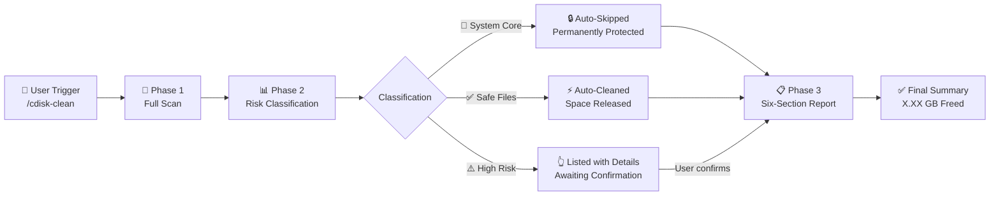
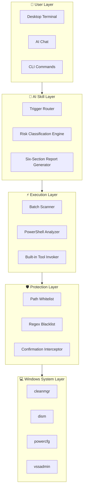

🌏 简体中文｜English Version
<p align="center">
  
  
  
  
  
</p>

<br>

<p align="center">
  <picture>
    <source media="(prefers-color-scheme: dark)" srcset="https://img.shields.io/badge/Disk%20Clean-Pro-2563EB?style=for-the-badge&logo=data:image/svg+xml;base64,PHN2ZyB4bWxucz0iaHR0cDovL3d3dy53My5vcmcvMjAwMC9zdmciIHdpZHRoPSIyNCIgaGVpZ2h0PSIyNCIgdmlld0JveD0iMCAwIDI0IDI0IiBmaWxsPSJub25lIiBzdHJva2U9IiNmZmYiIHN0cm9rZS13aWR0aD0iMiI+PHBhdGggZD0iTTIxIDE2VjhhNSA1IDAgMCAwLTUtNUg4YTUgNSAwIDAgMC01IDV2OGE1IDUgMCAwIDAgNSA1aDh6Ii8+PHBhdGggZD0iTTEyIDEydjYiLz48cGF0aCBkPSJNOSAxNWg2Ii8+PC9zdmc+">
    
  </picture>
</p>

<br>

<h1 align="center">C-DiskClean · AI Skill</h1>

<p align="center">
  <em>Windows C Drive cleanup — safe, intelligent, elegant.</em>
</p>

<p align="center" style="font-size: 18px; color: #6B7280; max-width: 680px; margin: 0 auto;">
  An AI-powered Skill for Windows system drive cleanup.<br>
  Scan first · Classify risk · Clean safely · Zero mistakes.
</p>

<br>

<p align="center">
  <a href="#-quick-start">
    
  </a>
  &nbsp;&nbsp;
  <a href="#-project-structure">
    
  </a>
</p>

<br>

<p align="center">
  <picture>
    <source media="(prefers-color-scheme: dark)" srcset="https://placehold.co/960x540/0F172A/94A3B8?text=Product+Screenshot+Coming+Soon&font=Inter">
    
  </picture>
</p>

<br>
<br>

---

<br>

## Table of Contents

<p align="center">

[✨ Why C-DiskClean](#-why-c-diskclean)
·
[🎯 Features](#-features)
·
[⚙️ Workflow](#️-workflow)
·
[🖥️ Usage](#️-usage)
·
[🧱 Architecture](#-architecture)
·
[📁 Project Structure](#-project-structure)
·
[🚀 Quick Start](#-quick-start)
·
[🗺️ Roadmap](#️-roadmap)
·
[📖 FAQ](#-faq)
·
[🤝 Contributing](#-contributing)
·
[📄 License](#-license)

</p>

<br>
<br>

---

<br>

## ✨ Why C-DiskClean

<p align="center" style="max-width: 720px; margin: 0 auto; color: #6B7280;">
  Traditional cleanup tools are either too aggressive — risking system corruption — or too conservative, leaving junk behind. We took a different path.
</p>

<br>

<table align="center">
  <tr>
    <td align="center" width="33%">
      <br>
      <br><br>
      <strong>Zero Risk</strong><br>
      <sub>Triple-tier risk classification<br>System files permanently protected</sub>
      <br><br>
    </td>
    <td align="center" width="33%">
      <br>
      <br><br>
      <strong>AI-Powered</strong><br>
      <sub>Intelligent file analysis<br>No technical knowledge needed</sub>
      <br><br>
    </td>
    <td align="center" width="33%">
      <br>
      <br><br>
      <strong>Built-in Tools Only</strong><br>
      <sub>Zero third-party dependencies<br>Every operation fully auditable</sub>
      <br><br>
    </td>
  </tr>
</table>

<br>
<br>

---

<br>

## 🎯 Features

<br>

<table align="center">
  <tr>
    <td width="50%">
      <br>

### 🔍 Full Disk Smart Scan

      One-click analysis of all C drive directories. Automatically identifies space-hogging file types and pinpoints junk sources.

      <br>
    </td>
    <td width="50%">
      <br>

### 📊 Triple-Tier Risk Classification

      🛑 System Core → Locked forever<br>
      ✅ Safe Junk → Auto-cleaned<br>
      ⚠️ High Risk → Requires your approval

      <br>
    </td>
  </tr>
  <tr>
    <td width="50%">
      <br>

### 🤖 One-Click AI Skill Deploy

      Import and go. Works with Claude, Cursor, OpenAI Codex, and any Skill-compatible AI client. No installation required.

      <br>
    </td>
    <td width="50%">
      <br>

### 📋 Six-Section Pro Report

      Red-line warning → Safe clean list → High-risk list → Official guide → Large file locator → Summary report

      <br>
    </td>
  </tr>
  <tr>
    <td width="50%">
      <br>

### 🖥️ Three-Platform Coverage

      **Desktop**: Run as admin in terminal<br>
      **Web**: Use directly in AI conversations<br>
      **CLI**: Trigger via `/cdisk-clean` command

      <br>
    </td>
    <td width="50%">
      <br>

### 🌍 Beginner-Friendly

      No command line knowledge. No system expertise. Just say "clean C drive" in your AI client and you're done.

      <br>
    </td>
  </tr>
  <tr>
    <td width="50%">
      <br>

### 🛡️ System File Blacklist

      Regex matching + path whitelist. System32, registry, and driver directories are absolutely untouchable under any circumstance.

      <br>
    </td>
    <td width="50%">
      <br>

### 🔓 MIT Open Source

      Fully open source. Free for commercial use. Every line of code is transparent, auditable, and forkable.

      <br>
    </td>
  </tr>
</table>

<br>
<br>

---

<br>

## ⚙️ Workflow

<br>



<br>
<br>

---

<br>

## 🖥️ Usage

<br>

### 🖥 Desktop · Windows Terminal

```bash
# Step 1: Right-click → "Run as Administrator" in terminal
# Step 2: Import SKILL.md into your AI client
# Step 3: Type the trigger phrase
clean C drive
```

The AI will run the full pipeline: scan → classify → auto-clean → report.

<br>

### 🌐 Web · AI Chat

In any Skill-compatible AI client (Claude / Cursor / OpenAI Codex):

> **You:** Clean C drive  
> **AI:** Scanning C drive space usage... [Auto-executing]

No command line required. Everything happens in the conversation.

<br>

### ⌨️ CLI · Terminal Trigger

```bash
# Claude Code CLI
/cdisk-clean

# Any Skill-compatible CLI
Trigger keywords: clean C drive / C drive cleanup / disk cleanup
```

<br>

> **Current Platform**: Windows · **Coming Next**: macOS / iOS

<br>
<br>

---

<br>

## 🧱 Architecture

<br>



<br>
<br>

---

<br>

## 📁 Project Structure

<br>

```
cdisk-clean/
├── SKILL.md                    # Skill entry point (CLI-ready)
├── README.md                   # 中文主文档 (Chinese)
├── README_EN.md                # English README (this file)
├── Windows-C盘智能安全清理大师.skill  # Universal Skill format (GUI clients)
├── LICENSE                     # MIT License
│
├── scripts/                    # Standalone executable scripts
│   ├── scan.bat               # Full disk scan script
│   ├── auto-clean.bat         # Safe auto-cleanup script
│   └── advanced-clean.bat     # High-risk cleanup (requires confirmation)
│
├── docs/                       # Documentation
│   ├── guide.md               # Complete usage guide
│   ├── faq.md                 # Frequently asked questions
│   ├── risk-levels.md         # Triple-tier classification reference
│   └── screenshots/           # Screenshots (placeholder)
│
└── .github/                    # GitHub config
    ├── ISSUE_TEMPLATE/
    └── PULL_REQUEST_TEMPLATE.md
```

<br>
<br>

---

<br>

## 🚀 Quick Start

<br>

### Requirements

| Item | Requirement |
|------|-------------|
| OS | Windows 10 / 11 (Windows only currently) |
| Privileges | Administrator (required for some operations) |
| AI Client | Claude / Cursor / OpenAI Codex / any Skill-compatible client |
| Dependencies | None |

<br>

### 3 Steps to Start

<br>

**① Clone the repo**

```bash
git clone https://github.com/your-username/cdisk-clean.git
```

<br>

**② Import into your AI client**

| Client | How to Import |
|--------|---------------|
| **Claude Code** | Place `cdisk-clean/` into `.claude/skills/` |
| **Cursor** | Settings → Skills → Import → Select `SKILL.md` |
| **OpenAI Codex** | Paste `SKILL.md` content into custom instructions |
| **Other Clients** | Import `Windows-C盘智能安全清理大师.skill` |

<br>

**③ Trigger the cleanup**

```
Type in your AI chat: clean C drive
```

The AI executes the entire workflow automatically. No commands to memorize.

<br>
<br>

---

<br>

## 🗺️ Roadmap

<br>

- [x] Triple-tier risk classification system
- [x] Six-section professional report
- [x] Claude / Cursor / OpenAI Codex multi-platform support
- [x] Safe files auto-cleanup
- [x] System core file blacklist protection
- [x] Desktop · Web · CLI coverage
- [x] MIT open source
- [ ] macOS support
- [ ] iOS Shortcuts integration
- [ ] Cleanup history and rollback
- [ ] Scheduled auto-cleanup (Cron)
- [ ] i18n (Japanese, Korean)
- [ ] Visual disk heatmap
- [ ] VS Code extension
- [ ] Enterprise batch deployment

<br>
<br>

---

<br>

## 📖 FAQ

<br>

<details>
<summary><strong>Is this tool safe? Will it delete important files by accident?</strong></summary>
<br>

**Absolutely safe.** We employ dual protection: triple-tier risk classification + regex blacklist. System32, drivers, and registry paths are untouchable. Safe junk is auto-cleaned; high-risk items require your explicit confirmation.

<br>
</details>

<details>
<summary><strong>Do I need to install anything?</strong></summary>
<br>

**Nothing at all.** This Skill exclusively uses Windows built-in tools (cleanmgr, dism, powercfg, etc.). You only need a Skill-compatible AI client.

<br>
</details>

<details>
<summary><strong>Which AI clients are supported?</strong></summary>
<br>

Currently: Claude, Cursor, OpenAI Codex, and all Skill-standard-compliant AI clients. Works on desktop, web, and CLI.

<br>
</details>

<details>
<summary><strong>I'm a complete beginner. Can I use this?</strong></summary>
<br>

**This is designed for you.** Just say "clean C drive" in your AI chat. Every step is explained clearly, and risky operations explicitly warn you about consequences.

<br>
</details>

<details>
<summary><strong>Why no macOS support yet?</strong></summary>
<br>

V1.0 focuses on Windows. macOS disk management is entirely different — we're planning macOS support in V1.1. Watch the repo for updates.

<br>
</details>

<details>
<summary><strong>Can deleted files be recovered?</strong></summary>
<br>

Regular deletions go through Recycle Bin. Deep cleans via `cleanmgr` and `dism` are irreversible — you'll be warned beforehand. High-risk items (Windows.old, restore points) are not deleted by default.

<br>
</details>

<details>
<summary><strong>Can I use this commercially?</strong></summary>
<br>

**Absolutely.** MIT license — free for commercial use, modification, and redistribution. No attribution required.

<br>
</details>

<details>
<summary><strong>How do I verify the cleanup actually worked?</strong></summary>
<br>

After every cleanup, a **six-section summary report** is generated, including before/after space comparison, per-item freed space, and pending items. Numbers don't lie.

<br>
</details>

<br>
<br>

---

<br>

## 🤝 Contributing

<br>

We welcome all forms of contribution — code, docs, translations, ideas.

<br>

```
1.  Fork the repo
2.  Create a branch: git checkout -b feat/amazing-idea
3.  Commit changes: git commit -m 'feat: add amazing idea'
4.  Push branch: git push origin feat/amazing-idea
5.  Open a Pull Request
```

<br>

**Contribution types:**

| Type | Description |
|------|-------------|
| 🐛 Bug Fix | Found a logic issue or compatibility problem |
| ✨ Feature | New cleanup item, new classification rule |
| 📝 Docs | Improve guides, translations, FAQ |
| 🎨 Adapter | Support for new AI clients |

<br>

> Please read [CONTRIBUTING.md](./CONTRIBUTING.md) for commit conventions and development workflow.

<br>
<br>

---

<br>

## 📄 License

<br>

```
MIT License · Copyright (c) 2024 Open Source Community

Free for commercial use · Free to modify · Free to redistribute
```

<br>

[](./LICENSE)

<br>
<br>

---

<br>

<p align="center">
  <sub>Made with 🩵 by the Open Source Community</sub>
</p>

<p align="center">
  <a href="https://github.com/your-username">GitHub</a>
  ·
  <a href="mailto:your-email@example.com">Email</a>
  ·
  <a href="https://your-website.com">Website</a>
</p>

<br>
<p align="center">
  <sub>2024 · C-DiskClean AI Skill · MIT License</sub>
</p>
