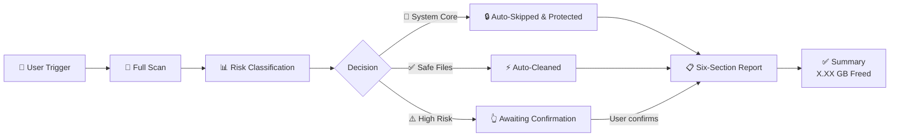
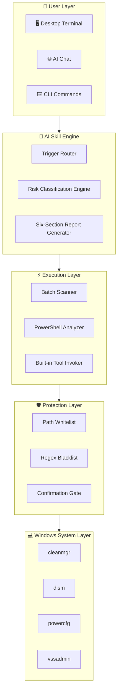

<p align="right">
  <a href="./README.md">🇨🇳 简体中文</a> &nbsp;|&nbsp; <strong>🇺🇸 English</strong>
</p>

<br>

<p align="center">
  <a href="https://github.com/Shirleypp012/windows-cdisk-clean-skill"></a>
  <a href="./LICENSE"></a>
  
  
  <a href="https://github.com/Shirleypp012/windows-cdisk-clean-skill/stargazers"></a>
</p>

<br>

<h1 align="center" style="font-weight: 700; letter-spacing: -1px;">
  C-DiskClean · AI Skill
</h1>

<p align="center">
  <em style="font-size: 20px; font-weight: 300;">Windows C Drive cleanup — safe, intelligent, elegant.</em>
</p>

<p align="center" style="color: #6B7280; max-width: 640px; margin: 0 auto; line-height: 1.8;">
  An AI-powered Skill for Windows system drive cleanup.<br>
  <strong>Scan first</strong> · <strong>Classify risk</strong> · <strong>Clean safely</strong> · <strong>Zero mistakes</strong>
</p>

<br>

<p align="center">
  <a href="#-quick-start">
    
  </a>
  &nbsp;&nbsp;
  <a href="#️-usage">
    
  </a>
  &nbsp;&nbsp;
  <a href="https://github.com/Shirleypp012/windows-cdisk-clean-skill">
    
  </a>
</p>

<br>


---

<br>

## Contents

<p align="center" style="line-height: 2.4;">

[✨ Why C-DiskClean](#-why-c-diskclean) · [🎯 Features](#-features) · [⚙️ Workflow](#️-workflow) · [🖥️ Usage](#️-usage) · [🧱 Architecture](#-architecture) · [📁 Project Structure](#-project-structure) · [🚀 Quick Start](#-quick-start) · [🗺️ Roadmap](#️-roadmap) · [📖 FAQ](#-faq) · [🤝 Contributing](#-contributing) · [📄 License](#-license)

</p>

<br>
<br>

---

<br>

## ✨ Why C-DiskClean

<p align="center" style="max-width: 720px; margin: 0 auto; color: #6B7280; line-height: 1.8;">
  Traditional cleanup tools are either <strong>too aggressive</strong> — risking system corruption — or <strong>too conservative</strong>, leaving junk behind.
  <br>
  We took a different path — <strong>AI makes the judgment, official tools do the work.</strong>
</p>

<br>

<p align="center">

| | | |
|:-:|:-:|:-:|
| <br>🛡️<br><br>**Zero Risk**<br><br><sub>Triple-tier classification<br>System files permanently protected</sub><br><br> | <br>🧠<br><br>**AI-Powered**<br><br><sub>Intelligent file analysis<br>No technical knowledge needed</sub><br><br> | <br>⚡<br><br>**Built-in Tools Only**<br><br><sub>Zero third-party dependencies<br>Every operation fully auditable</sub><br><br> |

</p>

<br>
<br>

---

<br>

## 🎯 Features

<br>

<table align="center">
  <tr>
    <td width="50%" valign="top">
      <br>

### 🔍 Full Disk Smart Scan

      One-click C drive analysis.
      Auto-identifies space-hogging files.
      Pinpoints junk sources precisely.

      <br>
    </td>
    <td width="50%" valign="top">
      <br>

### 📊 Triple-Tier Risk Classification

      🛑 **System Core** → Locked forever<br>
      ✅ **Safe Junk** → Auto-cleaned<br>
      ⚠️ **High Risk** → Requires your approval

      <br>
    </td>
  </tr>
  <tr>
    <td width="50%" valign="top">
      <br>

### 🤖 One-Click AI Skill Deploy

      Import and go. No installation.
      Works with Claude, Cursor, Codex.
      Just say "clean C drive" — that's it.

      <br>
    </td>
    <td width="50%" valign="top">
      <br>

### 📋 Six-Section Pro Report

      Red-line warning · Safe clean list · High-risk list
      Official guide · Large file locator · Summary

      <br>
    </td>
  </tr>
  <tr>
    <td width="50%" valign="top">
      <br>

### 🖥️ Three-Platform Coverage

      **Desktop** → Admin terminal, one click<br>
      **Web** → Right inside AI conversation<br>
      **CLI** → `/cdisk-clean` command trigger

      <br>
    </td>
    <td width="50%" valign="top">
      <br>

### 🌍 Beginner-Friendly

      No command line knowledge.
      No system expertise needed.
      Just say "clean C drive."

      <br>
    </td>
  </tr>
  <tr>
    <td width="50%" valign="top">
      <br>

### 🛡️ System File Blacklist

      Regex matching + path whitelist.
      System32, registry, drivers —
      <strong>absolutely untouchable</strong>.

      <br>
    </td>
    <td width="50%" valign="top">
      <br>

### 🔓 MIT Open Source

      Fully transparent. Free for commercial use.
      Audit, modify, redistribute — no strings attached.

      <br>
    </td>
  </tr>
</table>

<br>
<br>

---

<br>

## ⚙️ Workflow

<br>



<br>
<br>

---

<br>

## 🖥️ Usage

<br>

### 🖥 Desktop · Windows Terminal

```bash
# Step 1: Right-click → "Run as Administrator" in terminal
# Step 2: Import SKILL.md into your AI client
# Step 3: Type in your AI chat
clean C drive
```

> The AI runs the full pipeline: scan → classify → auto-clean → report. Zero command memorization.

<br>

### 🌐 Web · AI Chat

In any Skill-compatible AI client (Claude / Cursor / Codex):

> 👤 **You:** Clean C drive  
> 🤖 **AI:** Scanning C drive space... [Auto-analyzing → Auto-cleaning → Reporting]

No terminal needed. Cleanup happens in conversation.

<br>

### ⌨️ CLI · Terminal

```bash
# Claude Code CLI
/cdisk-clean

# Natural language triggers (any Skill-compatible CLI)
clean C drive / C drive cleanup / disk cleanup / free up disk space
```

<br>

> **📌 Current Platform: Windows 10 / 11**&nbsp;&nbsp;&nbsp;‖&nbsp;&nbsp;&nbsp; **🗓 Coming Next: macOS · iOS**

<br>
<br>

---

<br>

## 🧱 Architecture

<br>



<br>
<br>

---

<br>

## 📁 Project Structure

<br>

```
windows-cdisk-clean-skill/
├── SKILL.md                    # Skill entry point — CLI-ready
├── README.md                   # 中文主文档 (Chinese)
├── README_EN.md                # English README (this file)
├── Windows-C盘智能安全清理大师.skill  # Universal Skill format — GUI clients
├── LICENSE                     # MIT License
│
├── scripts/                    # Standalone executable scripts
│   ├── scan.bat               #   Full disk scan
│   ├── auto-clean.bat         #   Safe auto-cleanup
│   └── advanced-clean.bat     #   High-risk cleanup (requires confirmation)
│
├── docs/                       # Extended docs
│   ├── guide.md               #   Complete usage guide
│   ├── faq.md                 #   Detailed FAQ
│   ├── risk-levels.md         #   Triple-tier classification reference
│   └── screenshots/           #   📸 Product screenshots (placeholder)
│
└── .github/                    # GitHub community config
    ├── ISSUE_TEMPLATE/         #   Issue templates
    └── PULL_REQUEST_TEMPLATE.md # PR template
```

<br>
<br>

---

<br>

## 🚀 Quick Start

<br>

### Requirements

| Item | Requirement |
|------|-------------|
| 🖥 OS | **Windows 10 / 11** (macOS / iOS on the roadmap) |
| 🔑 Privileges | Administrator (required for cleanup operations) |
| 🤖 AI Client | Claude / Cursor / OpenAI Codex / any Skill-compatible client |
| 📦 Dependencies | **None** — uses Windows built-in tools exclusively |

<br>

### 3 Steps to Start

<br>

**① Clone the repo**

```bash
git clone https://github.com/Shirleypp012/windows-cdisk-clean-skill.git
```

<br>

**② Import into your AI client**

| Client | How to Import |
|--------|---------------|
| **Claude Code** | Place `windows-cdisk-clean-skill/` into `.claude/skills/` |
| **Cursor** | Settings → Skills → Import → Select `SKILL.md` |
| **OpenAI Codex** | Paste `SKILL.md` content into custom instructions |
| **Other Clients** | Import `Windows-C盘智能安全清理大师.skill` file |

<br>

**③ Start cleaning**

```
Type in your AI chat: clean C drive
```

> The AI executes the entire workflow automatically. **No commands to memorize.**

<br>
<br>

---

<br>

## 🗺️ Roadmap

<br>

- [x] Triple-tier risk classification system
- [x] Six-section professional report
- [x] Claude / Cursor / OpenAI Codex support
- [x] Safe files auto-cleanup
- [x] System core file blacklist protection
- [x] Desktop · Web · CLI coverage
- [x] MIT open source
- [ ] macOS support
- [ ] iOS Shortcuts integration
- [ ] Cleanup history & one-click rollback
- [ ] Scheduled auto-cleanup (Cron)
- [ ] i18n (Japanese, Korean)
- [ ] Visual disk heatmap
- [ ] VS Code extension
- [ ] Enterprise batch deployment

<br>
<br>

---

<br>

## 📖 FAQ

<br>

<details>
<summary><strong>Is this tool safe? Will it delete important files?</strong></summary>
<br>

**Absolutely safe.** Triple protection: ① triple-tier risk classification ② regex blacklist + path whitelist ③ human confirmation gate for high-risk items. System32, registry, and driver directories are untouchable.

<br>
</details>

<details>
<summary><strong>Do I need to install anything?</strong></summary>
<br>

**Nothing at all.** This Skill exclusively uses Windows built-in tools (`cleanmgr`, `dism`, `powercfg`, etc.). Zero third-party dependencies. You only need a Skill-compatible AI client.

<br>
</details>

<details>
<summary><strong>Which AI clients are supported?</strong></summary>
<br>

Claude, Cursor, OpenAI Codex, and all Skill-standard-compliant AI clients. Works on desktop, web, and CLI.

<br>
</details>

<details>
<summary><strong>I'm a total beginner. Can I use this?</strong></summary>
<br>

**This is built for you.** Just say "clean C drive" in your AI chat. Every step is explained clearly in plain language, and risky operations explicitly warn you and wait for confirmation.

<br>
</details>

<details>
<summary><strong>Why no macOS support yet?</strong></summary>
<br>

V1.0 focuses on Windows — the most widely used desktop OS where C drive clutter is most common. macOS disk management is fundamentally different. We're planning macOS in V1.1. <a href="https://github.com/Shirleypp012/windows-cdisk-clean-skill">Watch this repo</a> for updates.

<br>
</details>

<details>
<summary><strong>Can deleted files be recovered?</strong></summary>
<br>

- Regular temp files → recoverable via Recycle Bin
- `cleanmgr` + `dism` deep clean → **irreversible**, with clear warnings beforehand
- High-risk items (Windows.old, restore points) → **not deleted by default**, requires your explicit confirmation

<br>
</details>

<details>
<summary><strong>Can I use this commercially?</strong></summary>
<br>

**Absolutely.** MIT license — free for commercial use, modification, and redistribution. No attribution required. No restrictions.

<br>
</details>

<details>
<summary><strong>How do I verify the cleanup results?</strong></summary>
<br>

After each cleanup, a **six-section summary report** is generated: before/after space comparison, per-item freed space breakdown, and pending items list. Numbers don't lie.

<br>
</details>

<br>
<br>

---

<br>

## 🤝 Contributing

<br>

We welcome all contributions — code, docs, translations, ideas.

<br>

```bash
# Contribution workflow
1.  Fork the repo
2.  Create branch  →  git checkout -b feat/amazing-idea
3.  Commit changes →  git commit -m 'feat: add amazing idea'
4.  Push branch    →  git push origin feat/amazing-idea
5.  Open a Pull Request 🎉
```

<br>

| Type | Description |
|------|-------------|
| 🐛 Bug Fix | Found a logic or compatibility issue |
| ✨ Feature | New cleanup item, new classification rule |
| 📝 Docs | Improve guides, translations, FAQ |
| 🎨 Adapter | Support for new AI clients |

<br>

> Please read [CONTRIBUTING.md](./CONTRIBUTING.md) for commit conventions.

<br>
<br>

---

<br>

## 📄 License

<br>

```
MIT License · Copyright (c) 2024 Shirley

✅ Commercial use   ✅ Modify   ✅ Redistribute   ✅ No attribution required
```

<br>

[](./LICENSE)

<br>
<br>

---

<br>

<p align="center">
  <sub>Made with 🩵 by <a href="https://github.com/Shirleypp012">Shirley</a></sub>
</p>

<p align="center" style="line-height: 2.4;">
  <a href="https://github.com/Shirleypp012">🐙 GitHub</a>
  &nbsp;·&nbsp;
  <a href="mailto:1191728729@qq.com">📧 1191728729@qq.com</a>
  &nbsp;·&nbsp;
  <a href="https://github.com/Shirleypp012/windows-cdisk-clean-skill">⭐ Star this Project</a>
</p>

<br>
<p align="center">
  <sub>© 2024 Shirley · windows-cdisk-clean-skill · MIT License</sub>
</p>
